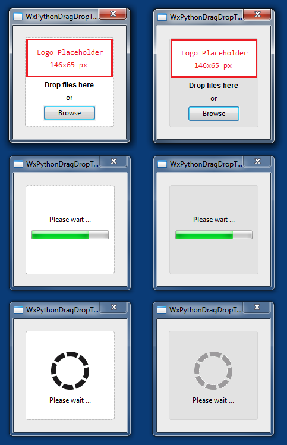

# wxPython Drag & Drop Template

This is a basic template for creating a Python application that uses [wxPython](http://wxpython.org) and acts as a drag & drop target for files and folders. 

The Python code of the graphical user interface in ``frame_main_gui.py`` and ``dialog_errorwarning_gui.py`` is generated by [wxFormBuilder](http://sourceforge.net/projects/wxformbuilder/) (3.5.1-RC1). The editable project file is the ``*.fbp`` file. Modify this file with WxFormbuilder and select *File*, *Generate code* afterwards.

The template comes with two different backgrounds for the drag & drop target and two different styles for visualizing the progress (gauge + animated ``*.gif`` file).

## Required non-standard Python libraries

- wxPython [link](http://wxpython.org)

## Sources

- [Mouse vs Python, Putting a Background Image on a Panel](http://www.blog.pythonlibrary.org/2010/03/18/wxpython-putting-a-background-image-on-a-panel/)
- [Mouse vs Python, Introduction to Drag and Drop](http://www.blog.pythonlibrary.org/2012/06/20/wxpython-introduction-to-drag-and-drop/)
- [Animated spinner gif from Preloaders.net](http://preloaders.net/en/circular)
- [Some icons by Yusuke Kamiyamane](http://p.yusukekamiyamane.com/)
- [wxPython Freezing Template on GitHub](https://github.com/geberl/wxpython_freezing_template)
- [eberl.se](http://www.eberl.se)
